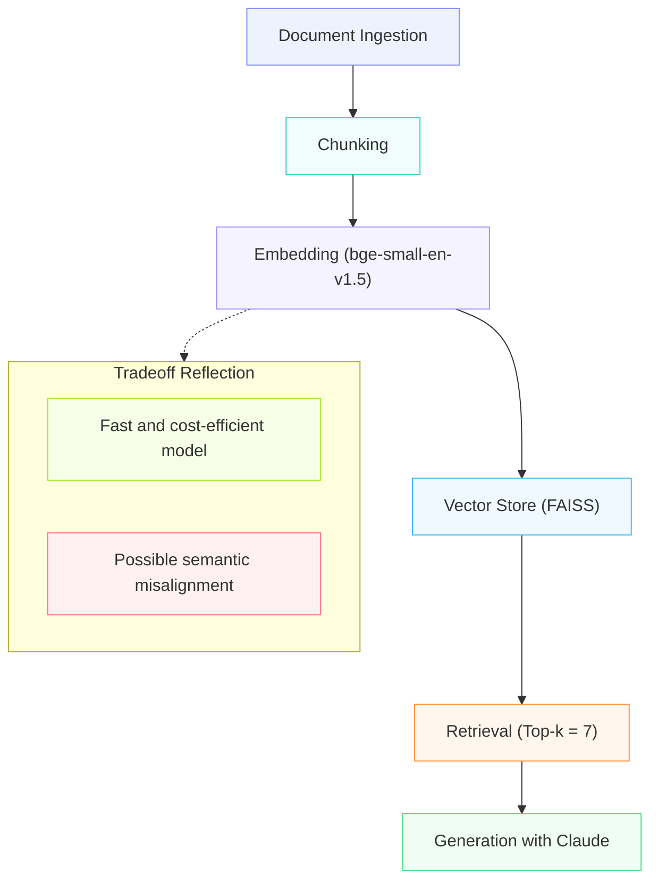

# Project 1 Planning: The Unofficial Guide

> Write this document before you write any pipeline code.
> Your spec and architecture diagram are what you'll use to direct AI tools (Claude, Copilot, etc.) to generate your implementation — the more specific they are, the more useful the generated code will be.
> Update the Retrieval Approach and Chunking Strategy sections if you change your approach during implementation.
> Update this file before starting any stretch features.

---

## Domain

<!-- What domain did you choose? Why is this knowledge valuable and hard to find through official channels? -->

The domain of my project focuses on providing students with the best options for food spots that are popular with other students (Specifically UC Berkeley students). 

This knowledge is usually pretty hard to find as the best food for a student can depend on if they are in the dorms with access to cafeterias meaning they use school based menu sites or simply prefer finding food recommendations off of reddit, snackpass, etc. There is a lot of sources to look through so this LLM allows the user to find everything with ease. 

---

## Documents

<!-- List your specific sources: URLs, subreddit names, forum threads, or file descriptions.
     Aim for at least 10 sources that together cover different subtopics or perspectives within your domain. -->

| # | Source | Type | URL or file path |
|---|--------|------|-----------------|
| 1 | Berkeley Menu | Website | https://dining.berkeley.edu/menus/ |
| 2 | DailyCal | Website/Blog | https://www.dailycal.org/a-uc-berkeley-foodie-s-guide-to-campus-eateries/article_9823ab86-61ca-42d8-9418-06f11251be3b.htmlive_tried_well_over_a_100_restaurants_around/|
| 3 | DailyCal | Website/Blog | https://www.dailycal.org/blogs/food-blog/tour-around-berkeley-s-best-coffee-and-study-spots/article_6c1f73a1-d93c-4f7f-a52c-1889db00589f.htmlabsolute_best_eats_in_berkeley/ |
| 4 | DailyCal | Website/Blog  | https://www.dailycal.org/blogs/a-taste-of-berkeley-s-plant-based-and-sustainable-eats/article_e76f9d3c-bdcd-456d-99bd-f7b17ab65b6d.htmlfavorite_food_spots_in_berkeley/ |
| 5 | Travelling Foodie | Website/Blog | https://travellingfoodie.net/places-to-eat-in-berkeley/ |
| 6 | DailyCal | Website/Blog | https://www.dailycal.org/2025-best-of-berkeley-food-edition/article_39fd173d-688c-4262-b429-d2051c998c98.html |
| 7 | Michelin Guide | Website | https://guide.michelin.com/us/en/california/berkeley/restaurants |
| 8 | SF Eater | Website | https://sf.eater.com/maps/best-restaurants-berkeley |
| 9 | GrubHub | Website | https://www.grubhub.com/search?orderMethod=delivery&locationMode=DELIVERY&facetSet=umamiV6&pageSize=36&hideHateos=true&searchMetrics=true&latitude=37.87152099&longitude=-122.27304078&geohash=9q9p3w73xehw&sortSetId=umamiV3&countOmittingTimes=true&tab=all&includeOffers=true&featureControl=fastTagBadges%3Atrue |
| 10 | DailyCal | Website/Blog | https://www.dailycal.org/blogs/food-blog/best-breakfast-spots-in-berkeley/article_0ba9913b-da5a-4fd8-9966-f0719abc9e1e.html |

---

## Chunking Strategy

<!-- How will you split documents into chunks?
     State your chunk size (in tokens or characters), overlap size, and explain why those
     numbers fit the structure of your documents.
     A review-heavy corpus warrants different chunking than a long FAQ. -->

**Chunk size:** ~ 200 characters

**Overlap:** ~ 30 characters

**Reasoning:** The majority of my sources contain small sentence segments as they are mostly short reviews, meaning that smaller chunk sizes are probably the most efficient 

---

## Retrieval Approach

<!-- Which embedding model are you using (e.g., all-MiniLM-L6-v2 via sentence-transformers)?
     How many chunks will you retrieve per query (top-k)?
     If you were deploying this for real users and cost wasn't a constraint, what tradeoffs
     would you weigh in choosing a different embedding model — context length, multilingual
     support, accuracy on domain-specific text, latency? -->

**Embedding model:** bge-small-en-v1.5

**Top-k:** 7 

**Production tradeoff reflection:** The model I chose is fast and cheap but might consider certain opinion-based words closer together than they are (e.g. Decent & Incredible). 

---

## Evaluation Plan

<!-- List your 5 test questions with their expected correct answers.
     Questions should be specific enough that you can judge whether the system's response
     is right or wrong. "What are good dining halls?" is too vague.
     "What do students say about wait times at [dining hall name] during lunch?" is testable. -->

| # | Question | Expected answer |
|---|----------|-----------------|
| 1 | What is dining hall at UC Berkeley has the most vegan options for dinner today? | (Pulls from Berkeley Menu) Clark Kerr has the most vegan options! |
| 2 | What are some good breakfast options around UC Berkeley? | Some options include La Note, Crepevine, and Eggy's neighborhood Kitchen |
| 3 | I want to splurge a little, show me a high end restaurant that is a little bit more on the expensive side | Try Chez Panisse, an Expensive Michelin Restuarant near you. |
| 4 | Show me french cuisine near me | Rêve Bistro is a french restuarant near your area. |
| 5 | Show me a cute cafe near me | Try Cafe Gara down telegraph. |

---

## Anticipated Challenges

<!-- What could go wrong? Name at least two specific risks with reasoning.
     Consider: noisy or inconsistent documents, missing source attribution, off-topic
     retrieval, chunks that split key information across boundaries. -->

1. While the majority of my text data is on the shorter side, I feel that there is a slight inconsistency in lengths from document to document, so retrieval might not be as effective on some platforms in comparison to others with the chunk size I chose. 

2. Some of the information on reddit is a little bit off-topic. For instance, users might be talking about something completely different from food on the replies to the threads I chose. 

---

## Architecture

<!-- Draw a diagram of your pipeline showing the five stages:
     Document Ingestion → Chunking → Embedding + Vector Store → Retrieval → Generation
     Label each stage with the tool or library you're using.
     You can use ASCII art, a Mermaid diagram, or embed a sketch as an image.
     You'll use this diagram as context when prompting AI tools to implement each stage. -->

Used a Mermaid Diagram!!

---

## AI Tool Plan

<!-- For each part of the pipeline below, describe:
     - Which AI tool you plan to use (Claude, Copilot, ChatGPT, etc.)
     - What you'll give it as input (which sections of this planning.md, which requirements)
     - What you expect it to produce
     - How you'll verify the output matches your spec

     "I'll use AI to help me code" is not a plan.
     "I'll give Claude my Chunking Strategy section and ask it to implement chunk_text()
     with my specified chunk size and overlap" is a plan. -->

**Milestone 3 — Ingestion and chunking:**

**Milestone 4 — Embedding and retrieval:**

**Milestone 5 — Generation and interface:**
